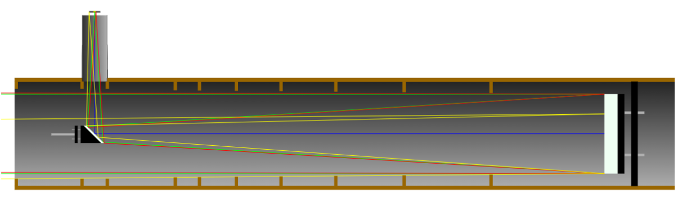

# 3D Printed Motorized Newtonian Telescope
This is an ongoing project with the objective of creating a full 3D printed telescope (apart from mirrors and lenses). The telescope will also have a auto aim system using setellarium data.

## Telescope Specs
<b>Primary Mirror Diameter: </b>114mm
 <b>Focal Lenght: </b>900mm
 <b>Diagonal Mirror Minor Axis: </b>25mm

 <b>Tube inside diameter: </b>150mm
 <b>Tube outside diameter: </b>3mm
 <b>Materials: </b>ABS, PLA

Image generated with: https://stellafane.org/tm/newt-web/newt-web.html

## Challenges
### Plastic Melting
Depending on how much light is getting into the tube, temperatures can get quite high, so it's essential for tube's material to have a high melting point. For this reason PLA is a discarded option of the tube and mirror holders.

### Weight
Having a light tube is important to avoid stalling of motors, combining with the high melting point requirement, <b>ABS</b> will be used to solve the problem, since it is lighter and has a higher melting point than PLA.

### Printing
Printing big ABS pieces in an open printer (Ender 3 V2) will probably be quite hard, so I might consider contracting a 3D printing service for some pieces (To be analysed).

### Big Pieces
The tube will have about 1 meter in length, therefore, I'll divide it into 6 smaller attachable pieces. This creates 2 main issues:
#### 1. Light getting into gaps
To solve this, the tube connection will embrace the upper tube, making it harder for the light to get through connection gaps.

#### 2. Printing attachable pieces
Printing with precision can be challenging due to the fact that the melted plastic will expand and spread (To be analysed).

## Auto Aiming
First of all, it's needed to fetch this data from somewhere. I'll use [Stellarium](https://github.com/Stellarium/stellarium), an open source software for checking celestial bodies positions relative to your location based on many sources. The software also provides a HTTP REST API that runs locally on your machine, which is awesome for comunicating constantly with the telescope with minimal delay.

The telescope rotation will be made by step motors (To be chosen). The motors show be positioned as close as possible to the center of mass of the telescope to avoid stalling (And to avoid spending to much money into too strong motors 😅)